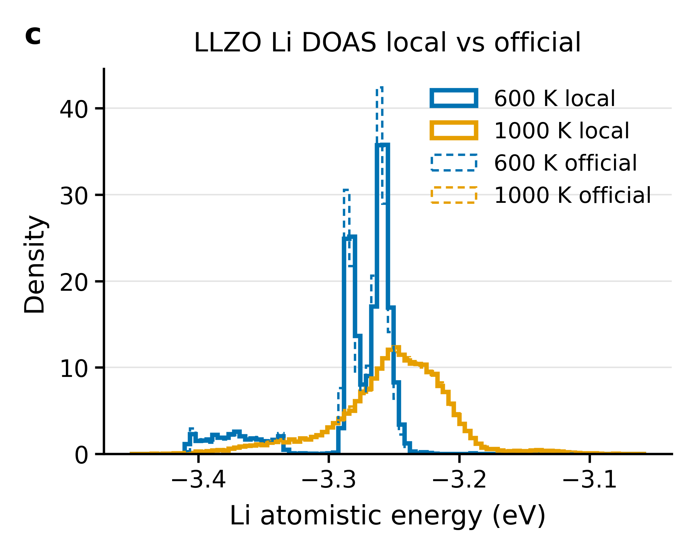
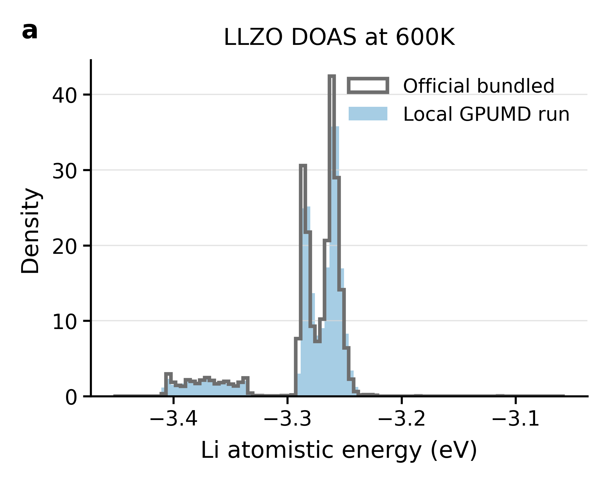
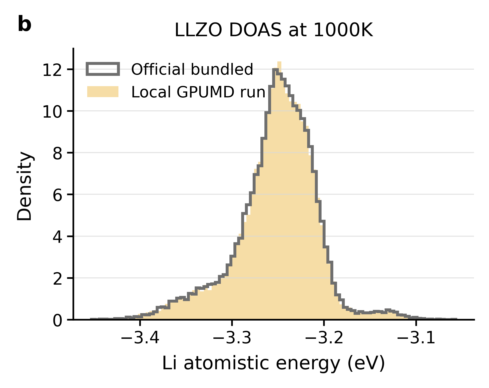

# Tutorial 32: DOAS and AEDP

This folder is for reproducing the official GPUMD-Tutorials `examples/32_DOAS_and_AEDP` workflow:

https://github.com/brucefan1983/GPUMD-Tutorials/tree/main/examples/32_DOAS_and_AEDP

## Reproduction Standard

This example should not be considered reproduced by simply replotting official `doas_*.out` or `position_energy.out` files. A successful reproduction must:

1. run the GPUMD MD stage locally for 600 K and 1000 K;
2. sample frames from the local `dump.xyz`;
3. minimize sampled frames locally with GPUMD;
4. extract local Li site-energy and position-energy tables;
5. compare local DOAS/AEDP plots with the official bundled reference.

## Local Data

- `600K/data/local_li_site_energy.csv`
- `600K/data/local_li_position_energy.csv`
- `1000K/data/local_li_site_energy.csv`
- `1000K/data/local_li_position_energy.csv`
- `summary.json`

## Reference Comparison

- 600 K local mean: -3.282 eV; official mean: -3.283 eV.
- 1000 K local mean: -3.252 eV; official mean: -3.252 eV.

| Local vs official DOAS | Local AEDP projections |
| --- | --- |
|  Local GPUMD-derived DOAS distributions compared with official bundled references. |  AEDP projections generated from locally minimized frames. |

| 600 K local vs official DOAS | 1000 K local vs official DOAS |
| --- | --- |
|  600 K local result compared with the official bundled DOAS table. |  1000 K local result compared with the official bundled DOAS table. |
